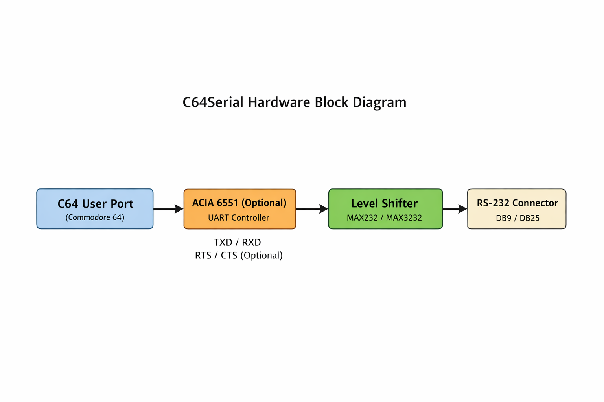

# C64Serial Hardware

This folder contains the clean-room schematic and block-level design
for the **C64Serial** project: a Commodore 64 User Port → RS-232 adapter.

## Overview

C64Serial provides a simple, well-documented RS-232 interface for the
Commodore 64. The design is fully self-contained, derived conceptually
from SukkoPera's Plus4Serial, but implemented as a clean-room
derivative.

### Block Diagram

- **C64 User Port** → optional **ACIA 6551** → **MAX232 / MAX3232 level shifter** → **RS-232 connector**  
- Handles TXD / RXD, optional RTS / CTS, DTR / DSR signals  
- Power can be supplied from the C64 User Port or an external source

---

## References

- Plus4Serial (SukkoPera) for conceptual guidance: https://github.com/SukkoPera/Plus4Serial  
- C64 User Port pinout: https://www.hardwarebook.info/C64_RS232_User_Port  
- ACIA 6551 datasheet  
- MAX232 / MAX3232 datasheets

---

## Notes

- This design is fully self-contained and **does not include any upstream files**.  
- Licensed under **CERN Open Hardware Licence Version 2 – Strongly Reciprocal (CERN-OHL-S)**  
- Attribution to SukkoPera for the conceptual origin of the project  
